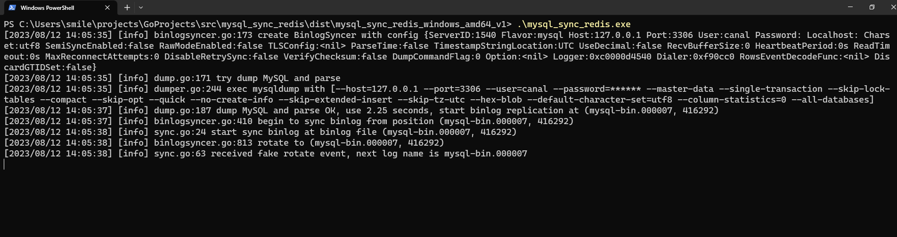
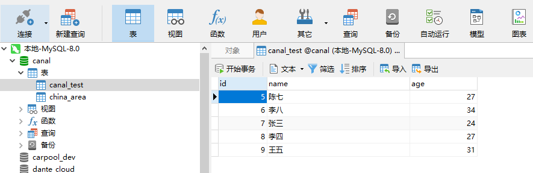
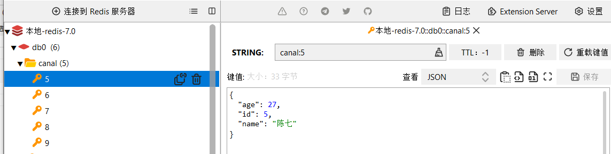

## mysql sync redis

### 创建 config.yaml 
```yaml
appName: mysql-sync-redis

## mysql 用户 必须拥有 RELOAD,SELECT, REPLICATION SLAVE, REPLICATION CLIENT 的权限。缺一不可
## CREATE USER canal IDENTIFIED BY 'canal';
## GRANT RELOAD,SELECT, REPLICATION SLAVE, REPLICATION CLIENT ON *.* TO 'canal'@'%';
## FLUSH PRIVILEGES;
mysql:
  addr: 127.0.0.1:3306
  username: canal
  password: canal

## 添加 masterName: 表示 Sentinel 模式
## 多个 addrs: 表示 集群模式
redis:
  addrs:
    - 127.0.0.1:6379
  db: 0
  # masterName: "myMaster"
  # password: 123456

rules:
  ## key ： 数据库名称.数据表名称
  ## tableId : 可以是数据表中的任意字段，但是必须 不为空 并且 唯一。如果不唯一会被覆盖
  ## redisKey : 保存到 redis 中的 key 名称
  ## redisKeyType :
  ##    string 类型。会以 redisKey:tableId 的形式保存 key
  ##    hash 类型。会以 hash 的形式保存
  - canal.canal_test:
      tableId: id
      redisKey: canal
      redisKeyType: string   # string or hash

  - canal.china_area:
      tableId: area_code
      redisKey: china_area
      redisKeyType: hash   # string or hash

```

### [下载可执行文件](https://github.com/thousmile/mysql_sync_redis/releases)
### 将 config.yaml 和 mysql_sync_redis 放在同一目录下

#### Linux or MacOS
```shell
# 添加执行权限
sudo chmod a+x mysql_sync_redis
# 运行
./mysql_sync_redis 
```

#### Windows
```shell
# 运行
./mysql_sync_redis.exe
```





